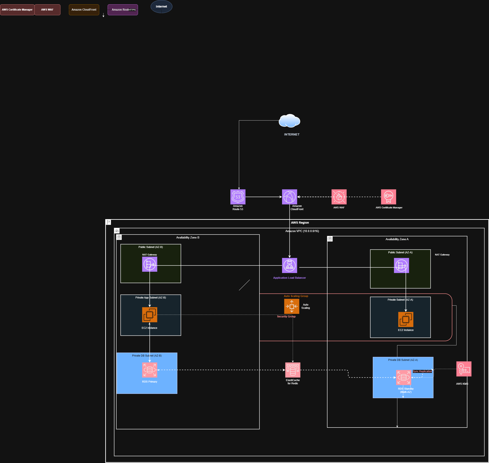

# Improved AWS Architecture for a Two-Tier Web Application

Based on the AWS Well-Architected Framework and Cloud Adoption Framework evaluation, the following architecture diagram and description represent a highly available, secure, and scalable design for the migrated two-tier web application.

**Architecture Diagram:**



    classDef aws fill:#FF9900,stroke:#232F3E,stroke-width:2px,color:white;
    class IGW,ALB,Route53 aws;
    classDef ec2 fill:#EF3A47,stroke:#232F3E,stroke-width:2px,color:white;
    class Web1,Web2 ec2;
    classDef rds fill:#3B48CC,stroke:#232F3E,stroke-width:2px,color:white;
    class DB1,DB2 rds;
```

## Architectural Components & WAF Alignment

### 1. **Amazon Route 53 & Application Load Balancer (ALB)**
*   **Component Route:** Route 53 handles DNS resolution and directs user traffic to the Internet-facing ALB. The ALB operates across multiple Availability Zones, ensuring fault-tolerant delivery of incoming web requests.
*   **WAF Alignment:** **Reliability** and **Performance Efficiency.** Load balancing improves resilience against localized failures and distributes traffic efficiently.

### 2. **Amazon EC2 Auto Scaling Groups (Frontend Layer)**
*   **Component Route:** The web application frontend resides on Amazon EC2 instances distributed across private subnets in two Availability Zones. The instances are managed by an Auto Scaling Group, automatically adjusting instance counts based on predefined traffic or CPU utilization thresholds.
*   **WAF Alignment:** **Cost Optimization** and **Reliability.** Auto Scaling ensures you only pay for compute capacity when needed, and replaces unhealthy instances automatically without manual intervention.

### 3. **Amazon RDS Multi-AZ Deployment (Backend Layer)**
*   **Component Route:** The on-premises database is migrated to an Amazon Relational Database Service (RDS) instance in a private subnet. A Multi-AZ deployment is configured, establishing a primary database instance in AZ A and synchronously mirroring data to a standby replica in AZ B.
*   **WAF Alignment:** **Reliability** and **Operational Excellence.** RDS automatically handles patching, backups, and failovers. During a primary database disruption, Amazon RDS automatically fails over to the standby.

### 4. **Amazon VPC, Private Subnets, & Security Groups**
*   **Component Route:** The network is segregated logically using an Amazon Virtual Private Cloud (VPC). The ALB resides in a public subnet with an Internet Gateway, while all EC2 web servers and RDS databases reside strictly in private subnets, unreachable directly from the internet. Security Groups act as stateful firewalls, permitting only traffic from the ALB to the EC2 instances, and only traffic from the EC2 instances to the RDS database port.
*   **WAF Alignment:** **Security.** Isolates critical infrastructure using defense-in-depth principles and tightly controlled least-privilege networking boundaries. AWS Key Management Service (KMS) is used to encrypt RDS storage at rest.
